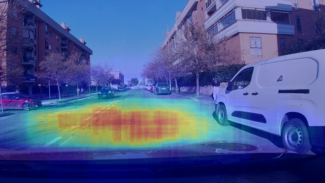

# Road Damage Detection

<p align="center">
  
  
  
  
</p>

A smart road inspection system for detecting potholes, cracks, and manholes using YOLO-based computer vision.



## Project overview

This repository contains a complete pipeline for training, comparing, and deploying multiple YOLO model variants for road damage inspection. The project is designed to support both notebook-based experimentation and a simple interactive Streamlit app for inference from uploaded images.

The main goals are:

- detect road damage objects automatically from images
- compare several YOLO backbones for performance and reliability
- visualize prediction quality with heatmaps and sample comparisons
- deploy a lightweight inspection dashboard for real-world use

## Models evaluated

The project compares these models:

- YOLOv8n
- YOLOv8s
- YOLOv8m
- YOLOv5s-u
- YOLOv11n

## Repository structure

```text
road dammage model/
├── assets/
│   └── road-damage-cover.png
├── notebooks/
│   └── road-damage-detection-final.ipynb
├── streamlit_app/
│   ├── app.py
│   ├── requirements.txt
│   └── models/
│       └── config.json
├── results/
│   └── results_summary.json
├── .gitignore
├── README.md
├── requirements.txt
└── exported_models/   # local trained weights, ignored in GitHub
```

## Quick start

1. Create a Python environment.
2. Install dependencies:

```bash
pip install -r requirements.txt
```

3. Run the Streamlit app:

```bash
cd streamlit_app
pip install -r requirements.txt
streamlit run app.py
```

## Notes

- The notebook in `notebooks/road-damage-detection-final.ipynb` walks through the full workflow from dataset splitting to model evaluation.
- The app loads the exported YOLO weights for inference.
- The evaluation summary is stored in `results/results_summary.json` and can be used for comparison and reporting.
- The trained weights are kept locally and excluded from GitHub to keep the repo lightweight.

## Demo highlights

- Upload a road image and run detection with a trained YOLO model
- View bounding boxes and confidence scores directly in the app
- Compare multiple model variants using the evaluation summary
- Inspect damage hotspots via the generated heatmap for better prioritization

## Use case

This system is useful for:

- road inspection teams
- infrastructure monitoring dashboards
- maintenance prioritization based on detected damage severity
- rapid visual assessment of road condition using AI
